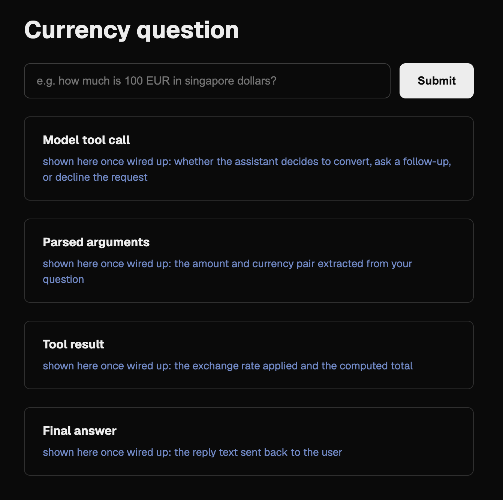

# Write-Up

## What this is

A minimal Next.js scaffold for a currency-question agent: a text input for
an FX question, a submit button (display-only for now — no model call is
wired up yet), and 4 labelled trace blocks in order: **Model decision**,
**Tool call arguments**, **Tool result**, **Final answer**. This is display
scaffolding for a future agent trace, not a working conversion agent yet.

## Building the display page

`app/page.tsx` holds the form and the 4 trace blocks, each with a one-line
placeholder showing what will eventually fill it once a real model call is
wired in.

## Building the rate table

`lib/rates.ts` is a fixed-rate table (explicitly not a live feed), keyed by
currency code, covering all seven required codes — USD, EUR, SGD, INR, JPY,
BHD, KWD — with each entry holding `rate` (units per 1 USD) and `decimals`
(how many decimal places that currency is normally written with).
`lib/print-rates.ts` (run via `npm run print-rates`) looks up and prints
JPY and KWD, showing the rate and the decimal count as two separate
fields, to confirm the 0-decimal and 3-decimal cases render correctly:

```
$ npm run print-rates
JPY: rate=146.82 decimals=0
KWD: rate=0.307 decimals=3
```

`tsc --noEmit` passes clean over the whole project. `lib/print-rates.ts` is
excluded from the main tsconfig's type-checked set because it imports
`"./rates.ts"` with an explicit `.ts` extension, which Node's ESM loader
requires at runtime but the project's `moduleResolution: "bundler"` setting
rejects at typecheck time for files still inside the app's compile.

## Verification

- `npm run dev` starts the app with that single command.
- `npm run build` compiles cleanly (Next.js + TypeScript, no errors).
- `npm run print-rates` prints JPY with 0 decimals and KWD with 3, matching
  `lib/rates.ts`.


